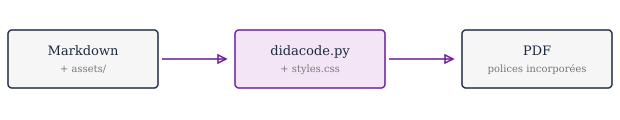

# Démonstration de Didacode

Ce document n'explique pas comment utiliser Didacode : il montre son rendu. Chaque section illustre un élément de mise en page disponible. Pour le voir en PDF :

```bash
python didacode.py -m exemple/exemple.md -o exemple.pdf \
       --title "Démonstration" --author "Votre nom"
```

ou, plus court, `python didacode.py --example`.

Le texte courant est composé dans la police serif déclarée en tête de `styles.css`, justifié, avec césures automatiques. Les paragraphes qui se suivent reçoivent un léger retrait de première ligne, comme celui-ci, afin de marquer visuellement leur enchaînement sans avoir à ajouter d'espace entre eux.

## Titres et structure

Chaque titre de niveau 2 démarre une nouvelle page : c'est ce qui donne au document son découpage en sections. Les niveaux inférieurs s'enchaînent dans le fil du texte. Avec `--page-breaks chapter`, seuls les titres de niveau 1 changent de page et le document devient nettement plus dense ; avec `none`, seules les lignes `---` provoquent un saut.

### Titre de niveau 3

Affiché en violet, plus compact. Un titre n'est jamais laissé seul en bas de page : il bascule avec le paragraphe qui le suit.

#### Titre de niveau 4

En italique, pour les subdivisions fines.

Deux titres identiques dans deux fichiers différents ne se marchent plus dessus : le générateur attribue un identifiant unique à chaque titre du document, et le sommaire pointe toujours sur le bon.

## Encadrés pédagogiques

Quatre encadrés sont disponibles. Le mot-clé doit ouvrir le premier paragraphe de la citation.

> [INFO] Pour apporter un complément utile mais non essentiel à la compréhension. Fond bleu clair.

> [IMPORTANT] Pour un point à retenir absolument. Fond violet.

> [WARNING] Pour signaler un piège ou une erreur fréquente. Fond orangé.

> [REMINDER] Pour rappeler une notion vue précédemment. Fond jaune.

Une citation sans mot-clé garde le rendu classique :

> Un programme doit être écrit pour être lu par un humain, et accessoirement pour être exécuté par une machine.

## Blocs de code

Le langage se déclare après les triples accents graves. La coloration est assurée par Pygments, par l'intermédiaire de l'extension `codehilite`.

```python
def moyenne(notes):
    """Calcule la moyenne d'une liste de notes."""
    if not notes:
        return 0.0
    return sum(notes) / len(notes)


resultat = moyenne([12, 15, 18])
print(f"Moyenne : {resultat:.2f}")   # -> Moyenne : 15.00
```

Un bloc n'est jamais coupé entre deux pages : s'il ne tient pas, il bascule entier sur la suivante.

### Autres langages

Tout identifiant connu de Pygments est accepté, y compris ceux qui contiennent un tiret ou un signe de ponctuation.

```c
#include <stdio.h>

int main(void) {
    for (int i = 0; i < 3; i++) {
        printf("tour %d\n", i);
    }
    return 0;
}
```

```nasm
section .text
global _start

_start:
    mov rax, 1          ; write
    mov rdi, 1          ; stdout
    syscall
```

```java
public class Bulletin {
    public static double moyenne(double[] notes) {
        return Arrays.stream(notes).average().orElse(0.0);
    }
}
```

```php
<?php
function moyenne(array $notes): float {
    return count($notes) ? array_sum($notes) / count($notes) : 0.0;
}
```

```sql
SELECT nom, AVG(note) AS moyenne
FROM resultats
GROUP BY nom
HAVING AVG(note) >= 10;
```

> [WARNING] Un bloc PHP écrit sans la balise `<?php` n'est pas colorié par Pygments. Les fichiers annexés avec `-c` sont détectés automatiquement, mais dans un bloc Markdown, il faut écrire la balise.

### Sorties de terminal

Pour un message d'erreur ou un affichage brut, sans coloration :

```text
TypeError: 'tuple' object does not support item assignment
```

> [INFO] Un bloc dont le langage n'est pas précisé est rendu sans coloration, et non plus interprété comme du Python.

Le code court s'écrit aussi dans le fil du texte : `len(x)`, `range(5)` ou `dico.get("clé")` apparaissent alors en violet sur fond gris.

## Tableaux

Les tableaux occupent toute la largeur, avec un en-tête bleu nuit et des lignes alternées.

| Structure | Syntaxe | Modifiable | Usage courant |
|---|---|---|---|
| Liste | `[1, 2, 3]` | oui | Données évolutives |
| Tuple | `(1, 2, 3)` | non | Données fixes, retours multiples |
| Dictionnaire | `{"a": 1}` | oui | Accès par clé |
| Ensemble | `{1, 2, 3}` | oui | Valeurs uniques |

Une colonne vide en tête permet de présenter des données en ligne :

| | P | y | t | h | o | n |
|---|---|---|---|---|---|---|
| Indice | 0 | 1 | 2 | 3 | 4 | 5 |
| Négatif | -6 | -5 | -4 | -3 | -2 | -1 |

## Listes

Les listes à puces utilisent un chevron violet :

- premier élément ;
- deuxième élément, avec un sous-niveau :
    - sous-élément,
    - autre sous-élément ;
- troisième élément.

Les listes numérotées gardent leurs chiffres, en bleu nuit :

1. Installer les dépendances.
2. Rédiger le Markdown.
3. Lancer la génération.

## Images

Les images se placent dans le projet, à côté du Markdown ou dans un sous-dossier :



Le chemin est résolu par rapport au fichier Markdown qui contient l'image, et jamais au-delà de la racine du projet. Une image absente ou située hors du projet arrête la génération au lieu de produire un PDF troué.

## Mise en forme du texte

Le **gras** sert aux termes importants, l'*italique* aux mots étrangers ou aux nuances. Les deux se combinent en ***gras italique***. Les liens sont soulignés en pointillé et affichent leur adresse à l'impression, comme [la documentation de WeasyPrint](https://doc.courtbouillon.org/weasyprint/).

## Saut de page manuel

Une ligne composée de trois tirets provoque un saut de page. Le filet horizontal habituel est masqué.

---

Cette phrase se trouve donc sur une nouvelle page, alors qu'aucun titre de niveau 2 ne l'a introduite.

## Pour aller plus loin

Les réglages typographiques se modifient dans `styles.css` : polices, taille du code, marges, couleurs, comportement des sauts de page. Les polices et les couleurs sont regroupées en variables au début du fichier, ce qui permet de changer la charte du document en quelques lignes.

> [REMINDER] Le fichier `config.exemple.yaml` évite de retaper les options à chaque génération.
